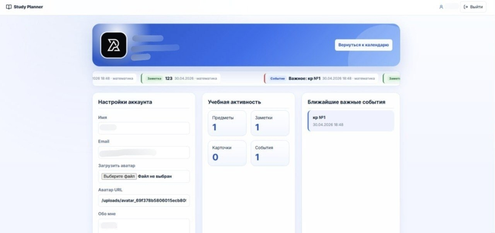

# Study Planner

Study Planner — учебное веб-приложение для организации учебного процесса.

В приложении можно создавать предметы, вести заметки, добавлять карточки для повторения, планировать события и работать с календарем. Проект состоит из frontend-части на React и backend-части на Go. Для хранения данных используется MongoDB.

## Возможности

- регистрация и вход в аккаунт;
- создание, редактирование и удаление предметов;
- создание заметок по предметам;
- добавление файлов к заметкам;
- создание карточек для повторения;
- календарь с событиями;
- общие события и события по отдельным предметам;
- просмотр ближайших событий;
- страница профиля;
- загрузка аватара;
- изменение данных пользователя;
- просмотр учебной активности.

## Интерфейс

### Страница входа


### Профиль пользователя



### Главная страница и календарь


## Технологии

| Часть проекта | Технологии |
|---|---|
| Frontend | React, Vite, React Router, Axios |
| Backend | Go, Gin |
| База данных | MongoDB |
| Авторизация | JWT, bcrypt |
| Конфигурация | godotenv |
| API | REST API |

## Структура проекта

```text
study-planner/
├── backend/
│   ├── cmd/
│   │   └── server/
│   ├── internal/
│   ├── pkg/
│   └── uploads/
├── frontend/
│   └── src/
│       ├── components/
│       ├── context/
│       ├── pages/
│       ├── services/
│       └── styles/
├── docs/
│   └── screenshots/
├── .gitignore
├── go.mod
├── main.go
└── README.md
```

## Запуск проекта

Для запуска проекта понадобятся:

- Go;
- Node.js;
- npm;
- MongoDB.

Проверить установку можно командами:

```bash
go version
node -v
npm -v
```

### Установка зависимостей frontend

Из корня проекта:

```bash
cd frontend
npm install
cd ..
```

### Настройка backend

Backend использует файл:

```text
backend/.env
```

Пример:

```env
APP_PORT=8080
APP_ENV=development
MONGO_URI=mongodb://localhost:27017
MONGO_DB_NAME=studyplanner
JWT_SECRET=your_secret_key
JWT_EXPIRES_IN=336h
FRONTEND_URL=http://localhost:5173
UPLOAD_DIR=uploads
MAX_UPLOAD_SIZE_MB=10
```

Файл `.env` не нужно добавлять в репозиторий.

### Настройка frontend

Frontend использует файл:

```text
frontend/.env
```

Пример:

```env
VITE_API_URL=http://localhost:8080/api
```

### Быстрый запуск

Из корня проекта:

```bash
go run . all
```

После запуска frontend будет доступен по адресу:

```text
http://localhost:5173
```

### Запуск только backend

```bash
go run . back
```

или:

```bash
cd backend
go run ./cmd/server
```

### Запуск только frontend

```bash
go run . front
```

или:

```bash
cd frontend
npm run dev
```

## Основные API-маршруты

### Авторизация

```text
POST /api/auth/register
POST /api/auth/login
GET  /api/auth/me
```

### Предметы

```text
GET    /api/subjects
POST   /api/subjects
PUT    /api/subjects/:subjectId
DELETE /api/subjects/:subjectId
```

### Заметки

```text
GET    /api/subjects/:subjectId/notes
POST   /api/subjects/:subjectId/notes
PUT    /api/subjects/:subjectId/notes/:noteId
DELETE /api/subjects/:subjectId/notes/:noteId
```

### Карточки

```text
GET    /api/subjects/:subjectId/flashcards
POST   /api/subjects/:subjectId/flashcards
PUT    /api/subjects/:subjectId/flashcards/:cardId
DELETE /api/subjects/:subjectId/flashcards/:cardId
POST   /api/subjects/:subjectId/flashcards/:cardId/review
```

### События

```text
GET  /api/events
POST /api/events
GET  /api/events/feed
GET  /api/events/upcoming
```

### Профиль

```text
GET /api/profile
PUT /api/profile
PUT /api/profile/password
```

## Работа с Git

После внесения изменений:

```bash
git add .
git commit -m "Update project"
git push
```

Перед коммитом можно проверить список файлов:

```bash
git status
```

В репозиторий не должны попадать `.env`, `node_modules` и локальные файлы из папки загрузок.

## Команда

Проект разработан командой из **3 человек**.

| Участник | Роль | Зона ответственности | GitHub |
|---|---|---|---|
| Виктория Сутормина | https://github.com/Vikki122222 |
| Павел Сидлецкий | https://github.com/va1les |
| Алексей Хромышев | https://github.com/Al3xKhrom |

